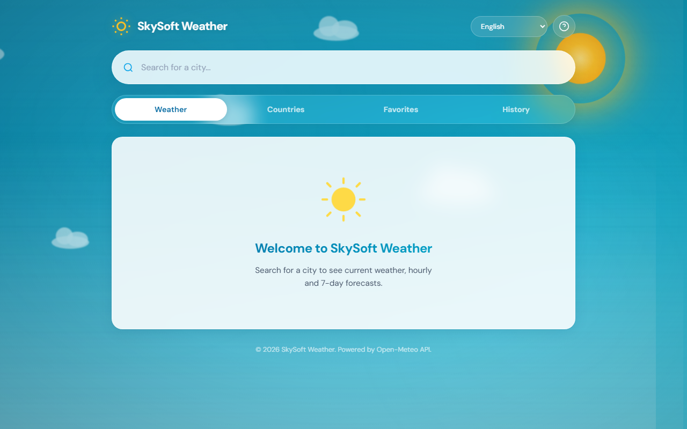
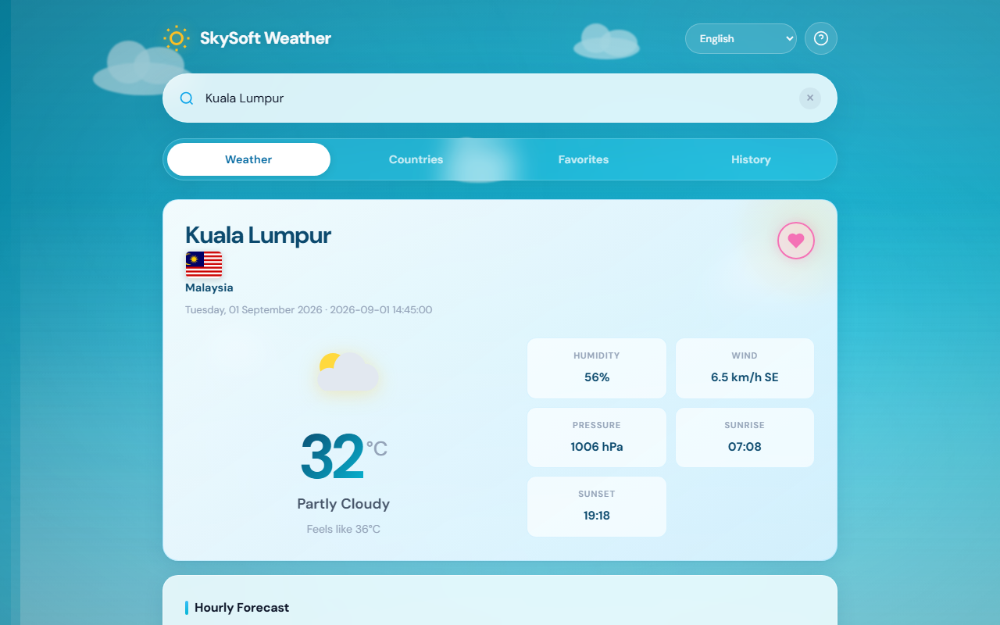
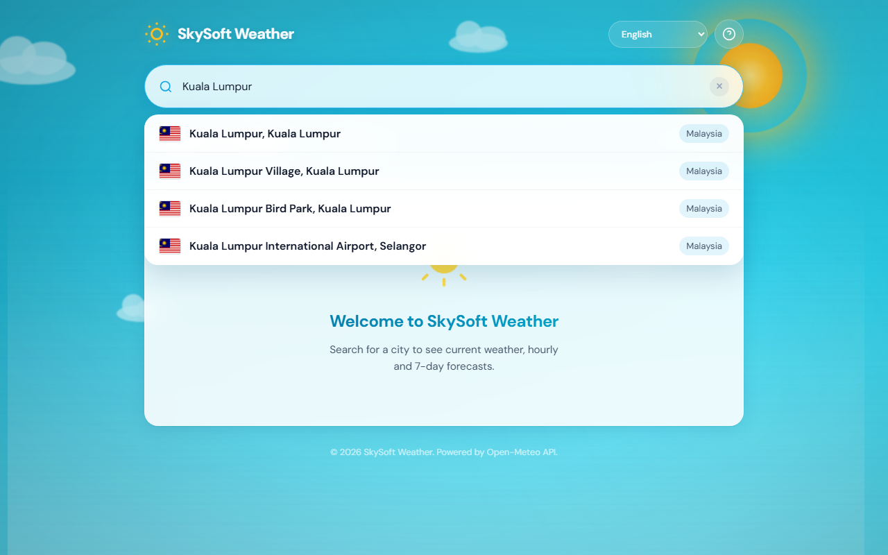
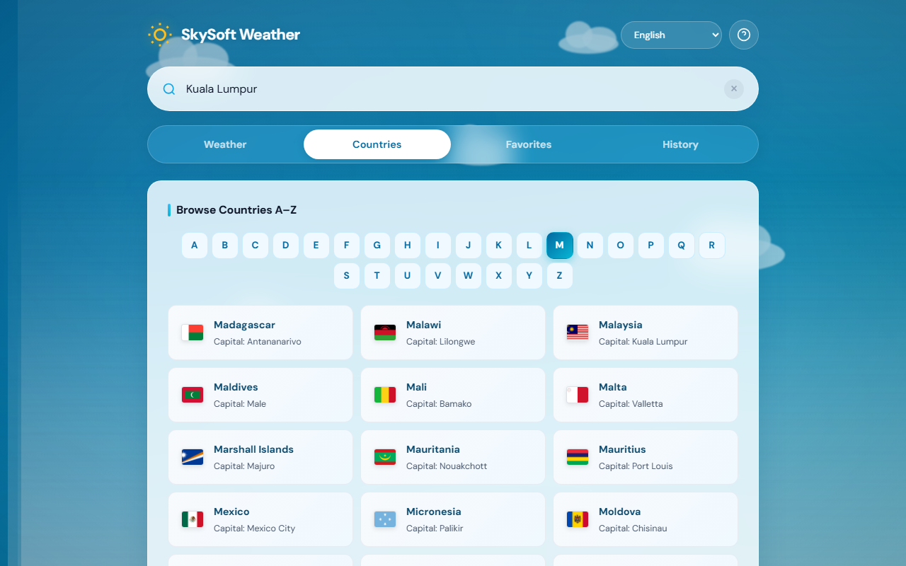
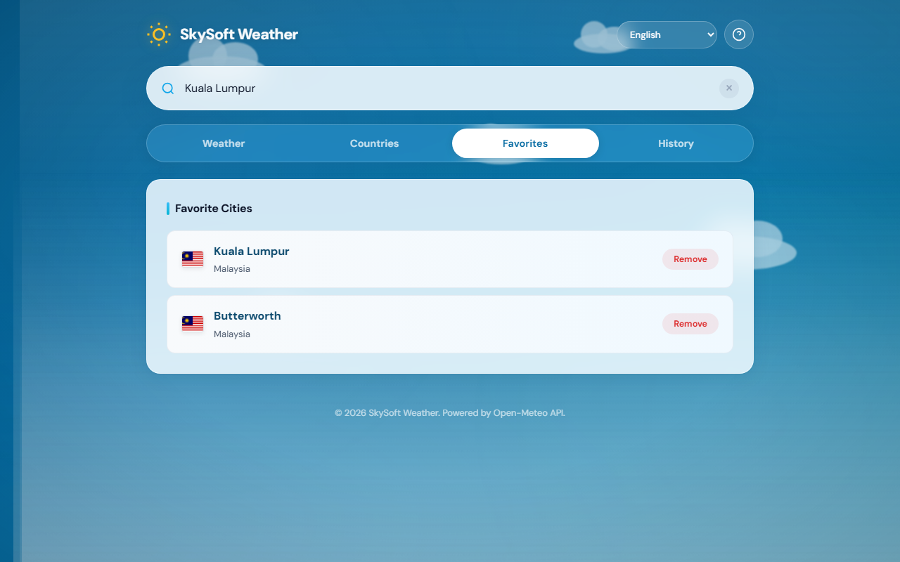
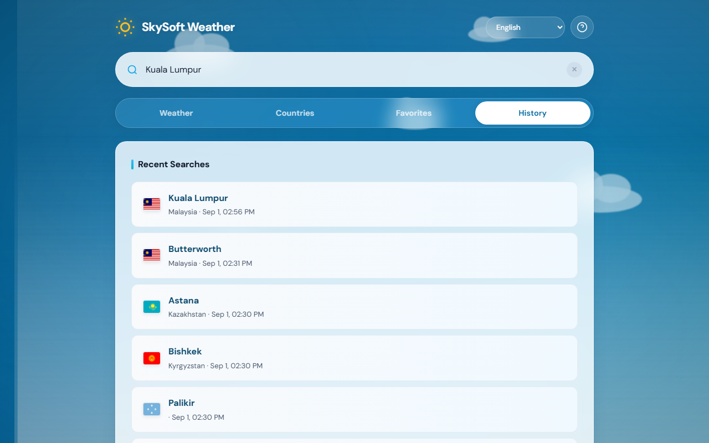

# SkySoft Weather

A modern, responsive weather forecast website built with PHP, MySQL, HTML5, CSS3, and Vanilla JavaScript. Uses real-time weather data from the [Open-Meteo API](https://open-meteo.com/).


## Screenshots

| Home | Weather Forecast |
|------|------------------|
|  |  |

| City Search | Countries A–Z |
|-------------|---------------|
|  |  |

| Favorites | Search History |
|-----------|----------------|
|  |  |

## Features

- **City Search** — Search cities worldwide with live suggestions while typing
- **Current Weather** — Temperature, feels-like, humidity, wind, pressure, sunrise/sunset
- **Hourly Forecast** — Next 24 hours with horizontally scrollable layout on mobile
- **7-Day Forecast** — Daily high/low temperatures and conditions
- **Country A–Z Browser** — Browse ~197 countries with flag icons
- **Favorites** — Save and manage favorite cities (MySQL)
- **Search History** — View recently searched cities (MySQL)
- **Multi-language** — English, Malay, Chinese, Japanese
- **Dynamic Themes** — Background changes with weather (rain, snow, storm, night)
- **User Manual** — Built-in help guide in all 4 languages
- **File Caching** — Weather (5 min) and search (30 min) caching
- **Graceful Degradation** — Weather works even if MySQL is unavailable

## Technologies

| Layer | Technology |
|-------|-----------|
| Backend | PHP 8+ |
| Database | MySQL (PDO) |
| Frontend | HTML5, CSS3, Vanilla JavaScript |
| API | Open-Meteo (Geocoding + Forecast) |
| Communication | Fetch API (AJAX) |

## Folder Structure

```
weather_forecast_system/
├── index.php
├── LICENSE
├── includes/
│   ├── config.example.php   ← copy to config.php
│   ├── config.php           ← local only (gitignored)
│   ├── db.php
│   ├── helpers.php
│   ├── footer.php
│   └── manual.php
├── api/
│   ├── countries.php
│   ├── search.php
│   ├── weather.php
│   └── history.php
├── assets/
│   ├── css/style.css
│   ├── js/ (app, i18n, theme, flags, manual)
│   └── data/countries.json
├── docs/screenshots/
├── cache/
├── sql/schema.sql
└── README.md
```

## Installation

### Prerequisites

- [XAMPP](https://www.apachefriends.org/) with PHP 8+ and MySQL
- Internet connection (for Open-Meteo API)

### XAMPP Setup

1. Clone this repository into your XAMPP `htdocs` folder:
   ```
   C:\xampp\htdocs\weather_forecast_system\
   ```

2. Start **Apache** and **MySQL** from the XAMPP Control Panel.

3. Copy the configuration example file:
   ```bash
   copy includes\config.example.php includes\config.php
   ```
   Edit `includes/config.php` and set your MySQL password if needed.

4. Ensure the `cache/` folder is writable by PHP.

### Database Setup

1. Open phpMyAdmin: `http://localhost/phpmyadmin`

2. Import `sql/schema.sql` (or let the app auto-create tables on first run).

3. Default credentials in `config.example.php`:
   - Host: `localhost`
   - Database: `weather_forecast`
   - User: `root`
   - Password: *(empty for default XAMPP)*

## How to Run

```
http://localhost/weather_forecast_system/
```

## API Endpoints

| Endpoint | Method | Description |
|----------|--------|-------------|
| `api/search.php?q=city` | GET | Search cities (geocoding) |
| `api/weather.php?lat=&lon=&timezone=` | GET | Get weather forecast |
| `api/countries.php?letter=A` | GET | Get countries by letter |
| `api/history.php?action=history` | GET | Get search history |
| `api/history.php?action=favorites` | GET | Get favorites |
| `api/history.php` | POST | Add/remove history or favorites |

## Troubleshooting

| Problem | Solution |
|---------|----------|
| Weather not loading | Check internet; verify Open-Meteo API is accessible |
| Database errors | Start MySQL; import `sql/schema.sql`; check `config.php` |
| Favorites/History disabled | Database unavailable — copy `config.example.php` to `config.php` |
| Blank page | Check Apache error log; ensure PHP 8+ is enabled |
| Cache issues | Delete files in `cache/` folder |

## License

This project is licensed under the [MIT License](LICENSE).

## Author

SkySoft Weather — Educational weather forecast system for XAMPP.
